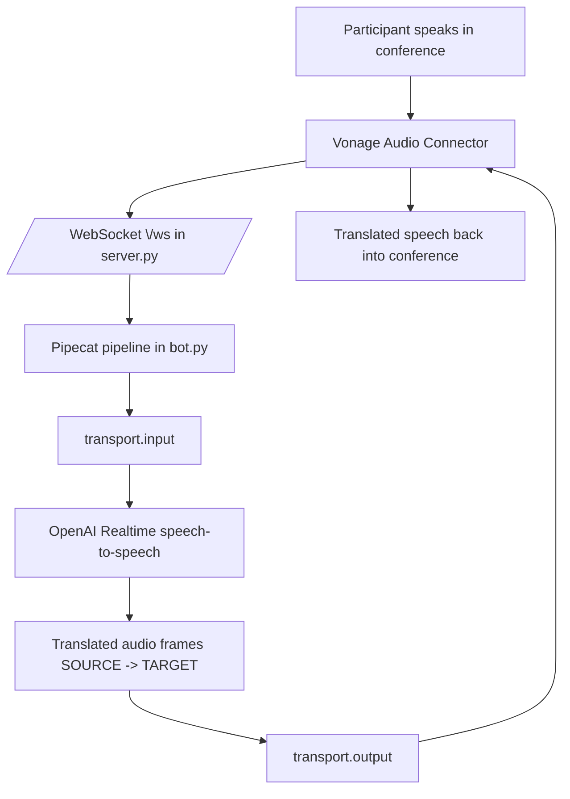

# Vonage Audio Connector Translation Bot

This example translates live conference speech in one direction using Vonage Audio Connector + Pipecat + OpenAI Realtime.

## What it does

- One speaker publishes original speech.
- Bot translates from `SOURCE_LANGUAGE` to `TARGET_LANGUAGE`.
- The same Playground participant can speak and hear translated audio in the same Vonage session.

## Pipeline flow (sequence)

```text
1) Conference audio (speaker) -> Vonage Audio Connector
2) Vonage Audio Connector -> WebSocket /ws (server.py)
3) server.py -> bot.py (Pipecat pipeline starts)
4) transport.input() -> OpenAI Realtime service
5) Realtime model translates from `SOURCE_LANGUAGE` -> `TARGET_LANGUAGE`
6) Realtime model returns translated speech audio
7) transport.output() -> Vonage Audio Connector
8) Vonage injects translated audio back into the same conference
```

At WebSocket connect time, the bot sends one system instruction built from:

- `SOURCE_LANGUAGE`
- `TARGET_LANGUAGE`

This instruction defines interpreter behavior, so the model translates each utterance turn-by-turn in real time.

### One-way case

- Speaker speaks in `SOURCE_LANGUAGE`.
- Bot outputs translated audio in `TARGET_LANGUAGE`.
- The same participant receives translated audio in the same conference session.

## Mermaid diagram



## Prerequisites

- Python 3.10+
- `uv`
- ngrok (for local public WebSocket URL)
- Vonage Video credentials (either application credentials or OpenTok key/secret)
- Existing Vonage Video session ID
- OpenAI API key

## Setup

1. Install dependencies:

```bash
uv sync
```

2. Configure environment:

```bash
cp env.example .env
```

3. Edit `.env` and set:

- `OPENAI_API_KEY`
- `VONAGE_SESSION_ID`
- `WS_URI` (example: `wss://<ngrok-domain>/ws`)
- Auth credentials:
  - Option A: `VONAGE_APPLICATION_ID`, `VONAGE_PRIVATE_KEY`
  - Option B: `OPENTOK_API_KEY`, `OPENTOK_API_SECRET`
- Optional API base override: `API_URL`
  - OpenTok key/secret path default: `https://api.opentok.com`
  - Application-auth path default: `api.vonage.com`
- One-way languages:
  - `SOURCE_LANGUAGE` (published speaker language)
  - `TARGET_LANGUAGE` (listener output language)

## Quick start (Playground flow only)

Follow these steps exactly in order:

1. Start server:

```bash
uv run server.py
```

2. Expose server publicly:

```bash
ngrok http 8005
```

3. Put ngrok websocket URL in `.env`:

- Set `WS_URI=wss://<ngrok-domain>/ws`

4. Join the Vonage session from Vonage Playground with one participant.

- Speak in `SOURCE_LANGUAGE`; translated output in `TARGET_LANGUAGE` is returned to the same session.

5. Trigger Audio Connector once from terminal:

```bash
curl -X POST http://localhost:8005/connect
```

The translated audio is injected back into the same conference session and is available to Playground participants.

